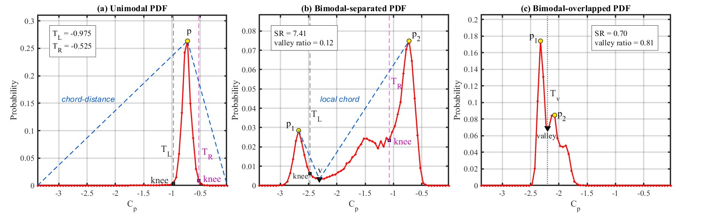
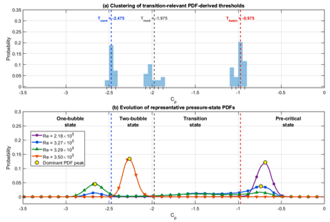
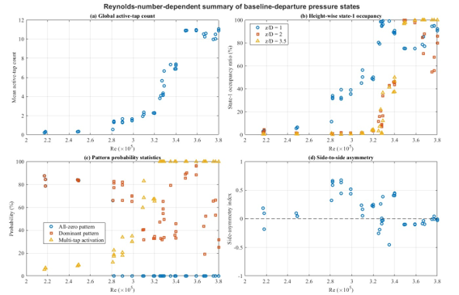

# Adaptive Threshold and Binary Mapping (AT-BM)

MATLAB implementation of the **Adaptive Threshold and Binary Mapping (AT-BM)**
framework for extracting local pressure-state boundaries and quantifying the
Reynolds-number-dependent organization of synchronized multi-tap surface
pressure signals.

This repository follows the latest manuscript methodology for a finite circular
cylinder with aspect ratio 4.
## Repository status

This repository provides the MATLAB implementation, validation procedures,
and representative outputs of the Adaptive Threshold and Binary Mapping
(AT-BM) framework.

The included synthetic example is directly executable. Exact reproduction of
the experimental figures requires the original synchronized pressure dataset,
the verified pressure-tap ordering, and the reviewed tap-specific operational
threshold table.

AT-BM produces **pressure-based operational state descriptions**. The derived
binary and hierarchical states should not be interpreted as direct
reconstructions of instantaneous separation or reattachment topology.

## Method, representative results, and validation

This repository provides the MATLAB implementation and supporting numerical
evidence for the Adaptive Threshold and Binary Mapping (AT-BM) framework.

The figures below summarize the construction of the adaptive thresholds, the
resulting Reynolds-number-dependent pressure-state statistics, and the
sensitivity analyses used to evaluate the robustness of the method.

The reported states are pressure-based operational descriptions and should not
be interpreted as direct instantaneous reconstructions of separation or
reattachment topology.

---

### 1. PDF morphology and adaptive-threshold extraction

Local pressure-coefficient PDFs are classified as unimodal,
bimodal-separated, or bimodal-overlapped. Depending on the PDF morphology,
the method retains chord-distance knee points, \(T_L\) and \(T_R\), or the
inter-peak valley, \(T_v\), as candidate pressure-state boundaries.

<p align="center">
  
</p>

**Figure 1.** Representative extraction of PDF-derived candidate thresholds
for unimodal, bimodal-separated, and bimodal-overlapped pressure
distributions.

---

### 2. Operational pressure-state hierarchy

For each pressure tap, candidate boundaries are pooled over the examined
Reynolds-number range. Recurrent transition-relevant candidate groups define
the tap-specific operational thresholds:

- \(T_{\mathrm{basic},j}\)
- \(T_{\mathrm{mod},j}\)
- \(T_{\mathrm{core},j}\)

Once selected, these thresholds are held fixed across Reynolds number.

<p align="center">
  
</p>

**Figure 2.** Representative clustering of PDF-derived candidates and the
corresponding operational pressure-state hierarchy. The displayed threshold
values correspond to the representative tap at \(z/D=2\) and
\(\theta=+90^\circ\); they are not universal values for all pressure taps.

---

### 3. Reynolds-number-dependent pressure-state statistics

The synchronized binary maps are summarized using the mean active-tap count,
height-wise state occupancy, binary-pattern probability, and complete-record
side-asymmetry index.

<p align="center">
  
</p>

**Figure 3.** Reynolds-number-dependent evolution of the global active-tap
count, height-resolved occupancy, representative pattern probabilities, and
side-asymmetry index.

---

### 4. Hierarchical pressure-state map

The three operational boundaries produce four pressure-state levels:

```text
Level 0: Cp >= Tbasic
Level 1: Tmod <= Cp < Tbasic
Level 2: Tcore <= Cp < Tmod
Level 3: Cp < Tcore
```

<p align="center">
  
</p>

**Figure 4.** Representative synchronized multi-tap hierarchical
pressure-state map. The hierarchy preserves pressure-state intensity while
retaining the temporal and spatial organization of the pressure-tap array.

---

## Robustness and sensitivity analyses

### 5. Histogram bin-width sensitivity

The sensitivity of the PDF-derived candidate thresholds to histogram
resolution is evaluated for representative unimodal, bimodal-separated, and
bimodal-overlapped pressure distributions.

<p align="center">
  
</p>

**Figure 5.** Sensitivity of the extracted candidate thresholds to histogram
bin width. The analysis evaluates whether the principal PDF-derived boundaries
remain stable under reasonable changes in discretization.

---

### 6. SR/VR modality-decision sensitivity

The peak-separation ratio, \(SR\), and valley ratio, \(VR\), are used to
distinguish separated and overlapped bimodal PDFs. Their influence is examined
over a range of decision criteria.

<p align="center">
  
</p>

**Figure 6.** Sensitivity of PDF morphology classification to the selected
\(SR\) and \(VR\) criteria. Representative separated and overlapped cases are
used to identify regions of stable classification.

---

### 7. Bootstrap repeatability

Bootstrap resampling is used to quantify the repeatability of the PDF-derived
candidate thresholds. Threshold variation is normalized by the interquartile
range of the corresponding pressure distribution.

<p align="center">
  
</p>

**Figure 7.** Bootstrap repeatability of the adaptive-threshold candidates for
representative PDF morphologies. The distributions quantify sampling
variability rather than Reynolds-number-dependent threshold adjustment.

---

## Scientific scope

AT-BM contains two explicitly separated stages:

1. **Adaptive Thresholding (AT)**  
   Local pressure PDFs are classified as unimodal, bimodal-separated, or
   bimodal-overlapped. Chord-distance knee points or an inter-peak valley
   provide PDF-derived candidate boundaries.

2. **Binary Mapping (BM)**  
   Tap-specific operational thresholds are obtained from recurrent candidate
   clusters pooled over the examined Reynolds numbers. Once selected, the
   thresholds are held fixed across Reynolds number. Threshold crossings are
   converted into synchronized binary vectors and summarized by active-tap
   count, height-wise occupancy, pattern probability, and side-asymmetry index.

The results are **pressure-based operational states**. They are not direct
reconstructions of instantaneous separation or reattachment topology.

## Latest implemented logic

- 12 taps at `theta = +/-90 deg` and `+/-110 deg`
- three heights: `z/D = 1, 2, 3.5`
- `Fs = 1000 Hz`, `120 s`, `120000 samples per tap`
- candidate thresholds: `TL`, `TR`, and `Tv`
- morphology criteria: `SR` and `VR`
- tap-specific `Tbasic,j`, `Tmod,j`, and `Tcore,j`
- thresholds pooled across Reynolds number and then fixed
- representative tap values:
  `Tbasic = -0.975`, `Tmod = -1.975`, `Tcore = -2.475`
- decimal pattern code used only as an identifier
- SAI defined from complete-record signed side occupancy

## Repository structure

```text
src/+atbm/       reusable core functions
scripts/         end-to-end analysis and figure generation
validation/      sensitivity and robustness checks
tests/           MATLAB unit tests
examples/        executable synthetic demonstration
config/          default parameters
docs/            method, equations, data format, and limitations
data/raw/        raw data; excluded from Git
results/         generated tables; excluded from Git
figures/         generated figures; excluded from Git
```

## Quick start

```matlab
setup;
run("examples/demo_ATBM.m");
```

Run tests:

```matlab
setup;
results = runtests("tests");
table(results)
```

Analyze experimental data:

```matlab
setup;
cfg = atbm.defaultConfig();
D = load("data/raw/ATBM_pressure_data.mat");
out = atbm.runATBM(D.Cp,D.Re,D.tapTable,cfg);
save("results/ATBM_results.mat","-struct","out","-v7.3");
```

## Required data

```matlab
Cp        % nSamples x nTaps x nRe
Re        % 1 x nRe
tapTable  % one row per tap
```

Required `tapTable` columns:

```text
TapID, zD, thetaDeg, Side, HeightGroup, BitIndex
```

## Validation

```matlab
run("validation/run_all_validation.m");
```

Validation includes:

- synthetic morphology tests;
- histogram bin-width sensitivity;
- PDF smoothing sensitivity;
- record-length sensitivity;
- threshold perturbation;
- pattern-encoding invariants;
- SAI invariants;
- tap-order and side-label checks.

## Figure entry points

```matlab
run("scripts/reproduce_all_figures.m");
```

The repository contains generation scripts for:

- Fig. 5: AT-BM workflow
- Fig. 6: adaptive-threshold examples
- Fig. 7: binary mapping and bit ordering
- Fig. 8: operational hierarchy
- Fig. 9-12: representative binary maps
- Fig. 13: full-Reynolds-number statistics
- Fig. 14: hierarchical pressure-state map

Exact publication reproduction requires the original experimental MAT file and
the final reviewed tap-wise threshold table.

## Reproducibility rules

1. Do not independently retune the final threshold at every Reynolds number.
2. Do not silently replace failed candidate extractions.
3. Store the exact tap order with every dataset.
4. Distinguish candidate thresholds from operational thresholds.
5. Export numerical tables in addition to figures.
6. Treat oil-film comparison as qualitative consistency only.
7. Do not interpret a near-zero SAI as proof of instantaneous symmetry.

## License

No license is assigned in this draft. Add one only after author approval.


