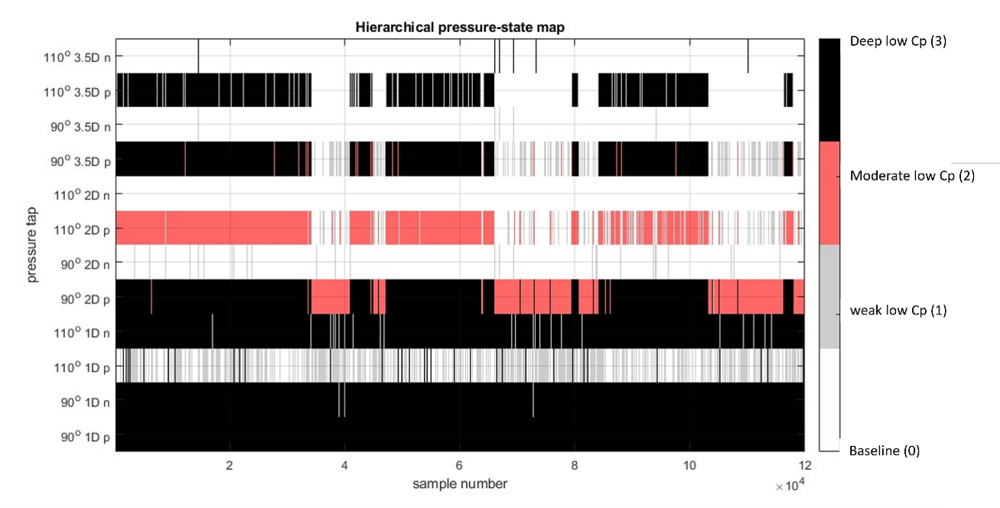
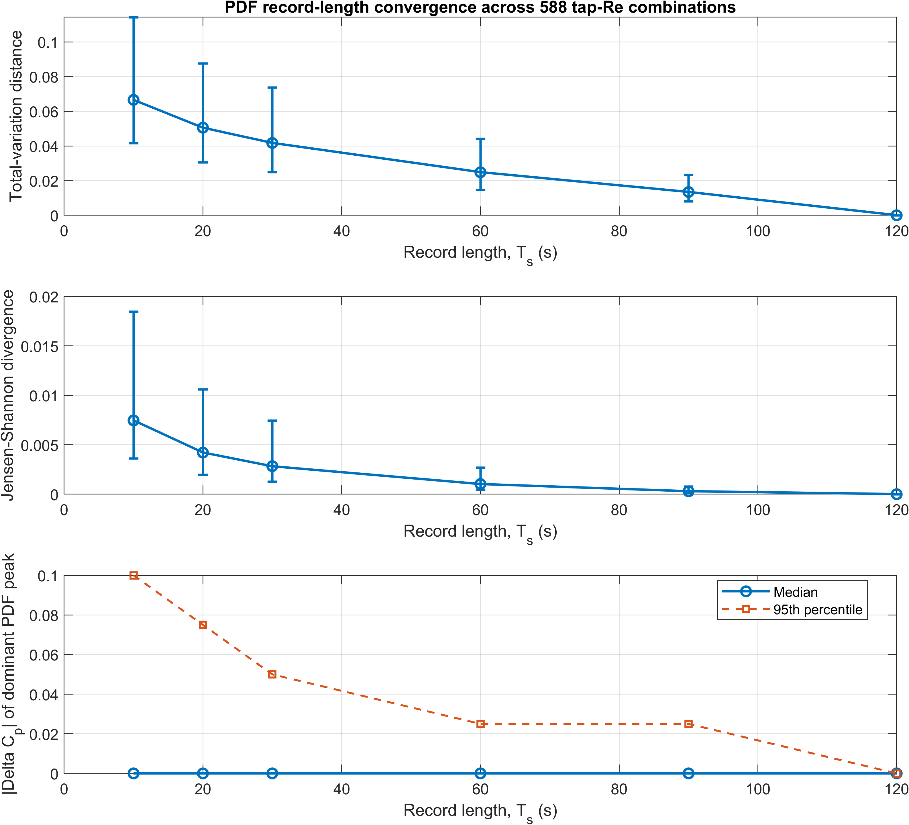
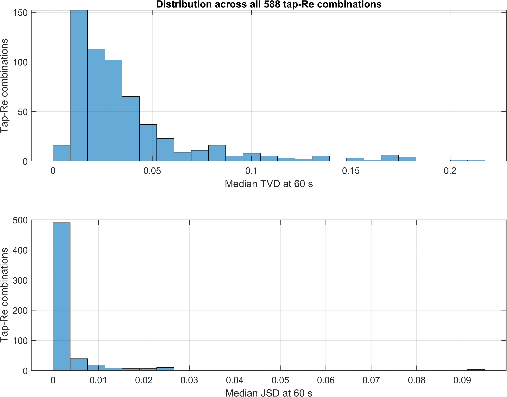

Adaptive Threshold and Binary Mapping (AT-BM)

MATLAB implementation of the Adaptive Threshold and Binary Mapping (AT-BM) framework used for pressure-state analysis of the aspect-ratio-4 finite circular cylinder.

This source-faithful rebuild was prepared directly from the author's original MATLAB programs. The supplied programs are preserved unchanged in legacy/original_matlab/, while the reusable functions in src/+atbm/ provide a path-independent workflow for loading the original .lvm files, restoring the familiar variables, extracting adaptive thresholds, and performing 12-tap binary mapping.

The repository also contains measured-data robustness analyses used to assess the sensitivity of the AT-BM framework to histogram construction, modality-decision criteria, finite-sample variability, and pressure-record duration.

Repository status

The code is separated into three clearly defined layers:

Reusable implementation — raw-data loading, calibration, AT extraction, BM encoding, hierarchy construction, and result tables.

Original-program reproduction — the supplied figure and sensitivity programs, executed after the original workspace variables are restored.

Robustness validation — measured-data analyses for histogram bin width, SR/VR criteria, bootstrap repeatability, and full-dataset record-length convergence.

The reviewed 12-tap baseline table, (T_{\mathrm{basic},j}), is provided in config/operational_thresholds_baseline_v3.csv. Complete tap-specific (T_{\mathrm{mod},j}) and (T_{\mathrm{core},j}) values are not invented by this repository.

AT-BM produces pressure-based operational state descriptions. Binary and hierarchical states are not direct reconstructions of instantaneous separation or reattachment topology.

Method and existing manuscript figures

1. PDF morphology and adaptive-threshold extraction

The implemented AT logic follows the original histogram/PDF procedure:

mode = 0: unimodal or fewer than two detected peaks; retain chord-distance knees TL and TR;

mode = 1: bimodal-separated; retain local chord-distance knees TL and TR;

mode = 2: bimodal-overlapped; retain the inter-peak valley Tv;

separated versus overlapped is decided using SR >= 1.5 and valley ratio VR <= 0.80 by default.

  

Figure 1. Representative extraction of PDF-derived candidate thresholds for unimodal, bimodal-separated, and bimodal-overlapped pressure distributions.

2. Operational pressure-state hierarchy

For each tap, PDF-derived candidate boundaries are pooled over the examined Reynolds-number range. Recurrent transition-relevant candidate groups define the operational pressure boundaries. Once selected, the boundaries are held fixed across Reynolds number.

The fixed operational thresholds are used as Reynolds-number-independent reference boundaries for comparative pressure-state mapping. They should not be interpreted as universal physical separation criteria.

  

Figure 2. Representative candidate clustering and pressure-state hierarchy at z/D = 2, theta = +90 deg. The displayed hierarchy values are representative, not universal values for all taps.

3. Reynolds-number-dependent pressure-state statistics

The binary state is defined as Cp < T, with state 1 representing a low-Cp threshold crossing. The synchronized maps can be summarized by active-tap count, tap and height occupancy, binary-pattern probability, and side-asymmetry statistics.

  

Figure 3. Reynolds-number-dependent pressure-state statistics.

4. Hierarchical pressure-state map

When complete tap-specific thresholds are supplied, the hierarchy is:

Level 0: Cp >= Tbasic
Level 1: Tmod <= Cp < Tbasic
Level 2: Tcore <= Cp < Tmod
Level 3: Cp < Tcore

  

Figure 4. Representative synchronized multi-tap hierarchical pressure-state map.

Robustness and sensitivity analyses

The repository contains both the original measured-data sensitivity programs and additional full-dataset validation analyses.

The different analyses address distinct sources of methodological uncertainty and should not be interpreted as interchangeable tests.

5. Histogram bin-width sensitivity

The sensitivity of PDF-derived threshold extraction to histogram construction is evaluated using the original measured-data implementation.

  

This analysis evaluates whether moderate changes in histogram bin width materially alter the PDF-derived threshold candidates.

6. SR/VR modality-decision sensitivity

The nominal distinction between separated and overlapped bimodal PDFs uses

SR >= 1.5
VR <= 0.80

Sensitivity analyses evaluate the stability of the modality decision when these criteria are perturbed.

  

This validation addresses the robustness of PDF morphology classification rather than Reynolds-number-dependent adjustment of the operational thresholds.

7. Bootstrap repeatability

Finite-sample repeatability of the PDF-derived thresholds is assessed using repeated resampling of the measured records.

  

The bootstrap analysis quantifies finite-sample statistical variability of the threshold-extraction procedure.

It is distinct from the record-length convergence analysis described below because bootstrap resampling does not preserve the original contiguous temporal organization of the intermittent pressure signal.

8. 

A separate record-length convergence analysis was added to evaluate whether the 120-s acquisition duration used in the manuscript is sufficient for stable estimation of the pressure-coefficient PDFs.

The analysis covers the complete AT-BM dataset:

49 Reynolds-number conditions
12 AT-BM pressure taps
588 tap-Reynolds-number combinations
Sampling frequency: 1000 Hz
Full record duration: 120 s
Samples per record: 120,000

For each tap and Reynolds-number condition, the PDF is recomputed using contiguous record lengths of

10 s
20 s
30 s
60 s
90 s
120 s

Contiguous windows are used instead of randomly shuffled samples so that the temporal persistence and intermittent switching of the measured pressure states are preserved.

The same PDF settings used in the manuscript are retained:

Histogram bin width: ΔCp = 0.025
Moving-average smoothing: 3 bins

Three complementary convergence quantities are evaluated:

Total Variation Distance (TVD) between each shorter-duration PDF and the complete 120-s PDF;

Jensen-Shannon Divergence (JSD) between the distributions;

dominant PDF peak displacement, used to distinguish changes in state location from changes in relative state occupancy.

An additional split-half comparison evaluates the first and second 60-s portions of each complete record independently.

  

Figure 5. Record-length convergence across all 588 tap-Reynolds-number combinations. TVD and JSD decrease systematically as the observation duration increases, while the dominant PDF peak location is comparatively stable.

  

Figure 6. Distribution of the 60-s convergence metrics over all 588 tap-Reynolds-number combinations.

The full-dataset results show that the principal PDF structure is generally established before the complete 120-s duration. The largest remaining differences in shorter records occur primarily in strongly intermittent transitional cases, where the relative probability associated with coexisting pressure states varies with the observation window.

Representative worst-converged cases show that the locations of the principal PDF modes remain comparatively stable, while their relative probability masses vary more strongly with shorter record lengths. This indicates that longer acquisition primarily improves estimation of intermittent-state occupancy rather than redefining the locations of the major pressure-response states.

The analysis therefore supports the use of the 120-s acquisition duration for the PDF-based AT-BM framework, particularly for highly intermittent conditions in the critical-transition regime.

The implementation is provided in:

validation/experimental/ATBM_R1_record_length_convergence_all.m

Selected full-dataset validation figures are retained in:

figures/

including:

R1_global_record_length_convergence.pdf
R1_global_record_length_convergence.png

R1_60s_metric_distributions.pdf
R1_60s_metric_distributions.png

worst_01_ReCase42_n90_2D.pdf
worst_02_ReCase42_n110_2D.pdf
worst_03_ReCase30_n90_3p5D.pdf
worst_04_ReCase30_n110_3p5D.pdf
worst_05_ReCase30_n110_2D.pdf
worst_06_ReCase30_n90_2D.pdf

The original synchronized pressure records are not distributed through this repository.

Original tap and bit ordering

The 12 BM taps are encoded in the original order:

bit 1  Cpp90_1D       bit 2  Cpn90_1D
bit 3  Cpp110_1D      bit 4  Cpn110_1D
bit 5  Cpp90_2D       bit 6  Cpn90_2D
bit 7  Cpp110_2D      bit 8  Cpn110_2D
bit 9  Cpp90_3_5D     bit 10 Cpn90_3_5D
bit 11 Cpp110_3_5D    bit 12 Cpn110_3_5D

The first tap is the most significant bit by default. The decimal pattern code is an identifier only.

Running the code

Quick start: one command in MATLAB

For the first run, provide the folder containing the original .lvm files:

D = start_atbm("I:\\your_path\\AR4\\原始訊號");

start_atbm performs four operations:

configures the repository path;

reads and calibrates the original .lvm files;

saves data/processed/ATBM_dataset.mat;

restores the familiar variables to the MATLAB base workspace.

After the standardized MAT file has been created, later sessions require only:

D = start_atbm();

The loader applies the original pitot, temperature, and pressure-channel calibration constants; calculates Cp, air density, velocity, and Reynolds number; and prepares all variables required by the original programs.

Examples immediately available in the Command Window are:

seg1 = Cpp90_2D(:,25);
seg2 = alldata{8}(:,25);
Re25 = Re(25);
result = atbm.extractAT(seg1);

Load an existing MAT file

setup;
D = atbm.loadDataset(fullfile('data','processed','ATBM_dataset.mat'));

atbm.loadDataset accepts:

a standardized MAT file containing D;

an older MAT file containing top-level variables such as Cpp90_2D;

the previous repository layout containing numeric Cp, Re, and tapTable.

Restore the original variables

atbm.exportLegacyVariables(D);

% Original variables now exist in the current workspace:
% Cpp90_2D, Cpp110_1D, Cpn90_3_5D, alldata, tapNames,
% Re, R, t, tt, Fs, edges, centers, ...

seg = Cpp90_2D(:,25);
result = atbm.extractAT(seg);

Direct access without workspace export is also available:

seg = atbm.getTap(D, 'Cpp90_2D', 25);
result = atbm.extractAT(seg);

Extract AT candidates for all 18 taps and cases

cfg = atbm.defaultConfig();
candidates = atbm.runCandidateExtraction(D, cfg);
writetable(candidates.table, fullfile('results','AT_candidates.csv'));

Run 12-tap baseline mapping

thresholdFile = fullfile('config','operational_thresholds_baseline_v3.csv');
out = atbm.runATBM(D, thresholdFile);
save(fullfile('results','ATBM_results.mat'), 'out', '-v7.3');

Reproduce the supplied measured-data validation

run_experimental_validation( ...
    fullfile('data','processed','ATBM_dataset.mat'));

This restores the original variables and executes the supplied validation programs without replacing their scientific logic.

Run the full-dataset record-length convergence test

First restore the original pressure variables:

D = start_atbm();

Then run:

run('validation/experimental/ATBM_R1_record_length_convergence_all.m');

The analysis uses the following 12 matrices:

Cpp90_1D
Cpn90_1D
Cpp110_1D
Cpn110_1D

Cpp90_2D
Cpn90_2D
Cpp110_2D
Cpn110_2D

Cpp90_3_5D
Cpn90_3_5D
Cpp110_3_5D
Cpn110_3_5D

Each matrix contains 120,000 pressure samples for each of the 49 Reynolds-number conditions.

Reproduce the three selected PDF morphology panels

figure_pdf_morphologies( ...
    fullfile('data','processed','ATBM_dataset.mat'));

The default cases are retained from the original program:

Cpp90_2D(:,7) — unimodal;

Cpp90_2D(:,25) — bimodal-separated;

Cpp70_1D(:,26) — bimodal-overlapped.

GitHub Actions

GitHub Actions runs only software unit tests and synthetic smoke tests.

A green Actions result confirms that the reusable code and data interfaces execute successfully; it does not claim reproduction of the unpublished experimental dataset or execution of the complete measured-data validation suite.

Repository structure

src/+atbm/                 reusable source-faithful MATLAB functions
scripts/workflows/         data preparation and analysis entry points
scripts/figures/           path-independent figure scripts
validation/experimental/   measured-data robustness and validation programs
legacy/original_matlab/    supplied original programs, unchanged
data/raw/                  raw .lvm files; excluded from Git
data/processed/            standardized MAT data; excluded from Git
config/                    calibration and threshold tables
tests/                     software unit and smoke tests
results/                   generated numerical tables; normally excluded from Git
figures/                   selected committed validation and manuscript figures
docs/images/               figures embedded in this README

MATLAB requirements

Core AT extraction and figure reproduction require MATLAB and Signal Processing Toolbox (findpeaks).

The original validation and comparison programs additionally use functions from Statistics and Machine Learning Toolbox, including:

randsample
iqr
boxchart
fitgmdist
ksdensity

The full-dataset record-length convergence analysis also uses standard MATLAB statistical distribution summaries and histogram operations.

Provenance and limitations

The pressure-channel calibration values were copied exactly from the supplied newatbm.m; no large offset was silently corrected.

The final histogram/SR/VR AT logic is kept separate from the earlier GMM/BIC/Otsu comparison branch.

The original synchronized experimental pressure dataset is not publicly distributed.

Raw .lvm files and standardized processed experimental datasets remain excluded from Git.

Selected validation figures are committed to document the robustness analyses supporting the manuscript.

Generated numerical tables may be reproduced locally from the validation scripts and experimental dataset.

The AT-BM pressure states are operational pressure descriptors and should not be interpreted as direct reconstructions of instantaneous separation or reattachment topology.

No license is declared until the author selects one.
